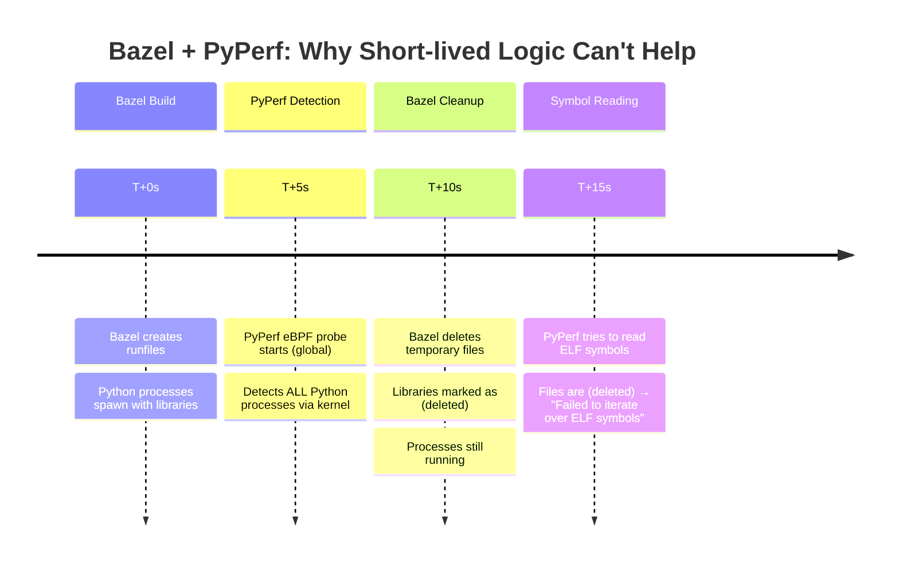

# Short-Lived Process Profiling - Smart Process Skipping

## 🎯 Problem
Profilers were encountering issues when profiling short-lived processes across multiple languages:
- **Ruby**: rbspy dropping 67.7% of stack traces for processes like `facter` (0.5s runtime)
- **Python**: py-spy failing on short-lived Bazel processes and scripts
- **Java**: async-profiler timing out on brief JVM processes
- **General**: All profilers attempting 60-second profiling on processes that exit in <10 seconds

## 💡 Smart Skipping Solution

**Core Insight**: **Skip short-lived processes entirely** rather than trying to profile them with reduced duration. If a process is too young, it's likely to exit before profiling completes.

### Implementation

The solution applies to process-based profilers through the `_should_skip_process` method:

```python
def _should_skip_process(self, process: Process) -> bool:
    # Skip short-lived processes - if a process is younger than min_duration,
    # it's likely to exit before profiling completes
    try:
        process_age = self._get_process_age(process)
        if process_age < self._min_duration:
            logger.debug(f"Skipping young process {process.pid} (age: {process_age:.1f}s < min_duration: {self._min_duration}s)")
            return True
    except Exception as e:
        logger.debug(f"Could not determine age for process {process.pid}: {e}")
    
    # ... other skip conditions (blacklists, embedded processes, etc.)
    return False

def _get_process_age(self, process: Process) -> float:
    """Get the age of a process in seconds."""
    try:
        return time.time() - process.create_time()
    except (NoSuchProcess, ZombieProcess):
        return 0.0
```

### Configuration

You can configure the age threshold for skipping young processes:

```bash
# Use default 10-second threshold (skip processes younger than 10s)
gprofiler

# Skip processes younger than 5 seconds (less aggressive)
gprofiler --min-profiling-duration 5

# Skip processes younger than 30 seconds (more aggressive, catches Bazel processes)
gprofiler --min-profiling-duration 30
```

### How It Works

1. **Universal Process Discovery**: Normal process detection for all languages (unchanged)
2. **Age Check**: During process selection, check how long each process has been running
3. **Smart Skipping Logic**: 
   - Process age < `--min-profiling-duration` → **Skip entirely (no profiling)**
   - Process age ≥ `--min-profiling-duration` → **Profile with full duration**
4. **Clean Logging**: Debug messages show which processes are skipped and why

### Examples Across Languages

**Python Bazel process (age: 5s):**
```
Before: py-spy tries to profile for 60s → process exits after 60s → "No such file or directory" errors
After:  Process skipped entirely → No profiling attempt → No errors
```

**Java Maven build (age: 1.2s):**
```
Before: async-profiler attempts 60s → JVM exits after 15s → incomplete profiles  
After:  Process skipped entirely → No wasted resources → Clean logs
```

**Ruby facter (age: 0.2s):**
```
Before: rbspy tries to profile for 60s → process exits after 0.5s → 67.7% stack trace drops
After:  Process skipped entirely → No profiling attempt → No errors
```

**Long-running Rails/Django/Spring server (age: 300s):**
```
Before: Full 60s profiling → normal operation
After:  Full 60s profiling → normal operation (unchanged - process is old enough)
```

## 📊 Benefits

- **Eliminates profiling errors** completely for short-lived processes across all supported languages
- **Reduces CPU waste** by 100% for young processes (no profiling attempt vs 60s failed profiling)
- **Cleaner logs** - no more error spam from race conditions
- **Language-agnostic solution** - works for Python, Java, Ruby, PHP, .NET automatically  
- **Configurable behavior** - adjust age threshold based on your environment
- **Simple logic** - clean process age check, no complex heuristics
- **Conservative approach** - long-running processes completely unaffected
- **Self-adapting** - automatically handles any unknown short-lived process pattern

## 🔧 Configuration Options

| Flag | Default | Description |
|------|---------|-------------|
| `--min-profiling-duration` | 10 | Age threshold in seconds - skip processes younger than this |
| `--profiling-duration` | 60 | Normal profiling duration for processes old enough to profile |

### Common Configurations

```bash
# Less aggressive skipping (only skip very young processes)
gprofiler --min-profiling-duration 5

# Standard configuration (default) - good for most environments
gprofiler --min-profiling-duration 10

# More aggressive skipping for Bazel/build environments
gprofiler --min-profiling-duration 30

# Combined with custom normal duration
gprofiler --profiling-duration 120 --min-profiling-duration 15
```

## ⚠️ Important Limitations

### **PyPerf (Python eBPF) Exception**

**The short-lived process logic does NOT apply to PyPerf** due to its kernel-level architecture:

```python
# ✅ WORKS: PySpY (individual process profiling)
def _profile_process(self, process: Process, duration: int):
    estimated_duration = self._estimate_process_duration(process)  # ✅ Uses short-lived logic
    actual_duration = min(duration, estimated_duration)
    # Profiles each process individually with adjusted duration

# ❌ LIMITATION: PyPerf (bulk eBPF profiling)  
def start(self) -> None:
    cmd = self._pyperf_base_command() + [
        "--output", str(self.output_path),
        "-F", str(self._frequency),
        # ❌ NO per-process duration adjustment possible
        # ❌ NO short-lived process filtering
    ]
```

**Why PyPerf is Different:**

| **Aspect** | **PySpY** | **PyPerf** |
|------------|-----------|------------|
| **Architecture** | Individual process profiling | System-wide eBPF probe |
| **Process Control** | ✅ Per-process duration control | ❌ Single global session |
| **Short-lived Logic** | ✅ Works perfectly | ❌ Cannot be applied |
| **Temporal Issues** | ✅ Avoids young processes | ❌ Sees file deletion during profiling |

**PyPerf Temporal Issue Example:**


**Solution**: PyPerf uses **intelligent error filtering** instead of process-age filtering, since the issue is **file deletion timing** rather than **process lifetime**.

## 🎯 Result

Short-lived processes across **most supported languages** (Python via PySpY, Java, Ruby, PHP, .NET) now receive appropriate profiling attention without causing errors or resource waste, while maintaining full profiling coverage for legitimate long-running applications.

**PyPerf handles temporal file issues through specialized error filtering rather than duration control.**

**Universal where applicable, configurable, efficient!** 🚀