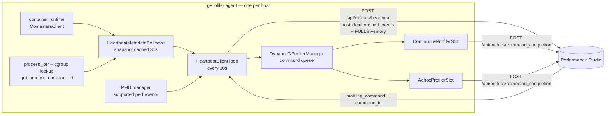

# Workload-Level Profiling Spec for gProfiler

## Purpose

This spec defines the agent-side contract for workload-level profiling support.
It is intended to support spec-driven development for future heartbeat, targeting,
and Kubernetes metadata changes in the `gprofiler` repo.

The key idea is that the agent keeps host-command execution semantics, but
publishes richer workload inventory through heartbeat metadata so the backend can
resolve workload selections into concrete host and process targets.

## Scope

This spec covers:

- heartbeat payload extensions sent by the gProfiler agent
- best-effort workload inventory discovery from container runtime metadata
- compatibility constraints with the existing host-based command queue
- expected follow-up workflow for spec-driven development

This spec does not redefine profile storage, flamegraph rendering, or
Performance Studio UI behavior beyond the contract the agent must satisfy.

## Goals

1. Allow Performance Studio to target namespaces, pods, containers, and
   processes without replacing the existing host-based command-delivery model.
2. Keep the agent implementation additive and backward compatible.
3. Make workload targeting safe even when Kubernetes metadata is partial.
4. Ensure future changes start by updating this spec before code changes land.

## Non-Goals

- introducing a new agent-side workload scheduler
- turning commands into pod-native or container-native execution primitives
- guaranteeing perfect Kubernetes workload-name inference across all runtimes
- supporting workload discovery without a visible container runtime

## Design Summary

The gProfiler agent continues to:

- receive commands per `(hostname, service_name)`
- execute profiling based on resolved PIDs or host-wide settings
- report command completion via the existing heartbeat control plane

The new behavior is:

- collect best-effort container inventory during heartbeat generation
- attach Kubernetes-aware metadata when available
- publish process membership by container so the backend can resolve workload
  selections into host/PID mappings before command creation

## Agent Architecture

The heartbeat loop is the agent's only control-plane channel: it publishes
inventory and receives commands on the same 30-second beat. Workload support
adds a metadata collector to that loop and changes nothing about execution.



## Inventory Collection Model

`HeartbeatMetadataCollector` builds the inventory snapshot and caches it for
`refresh_interval_seconds` (30s), matching the heartbeat interval. The cache
bounds discovery cost: `/proc` is walked at most once per interval even if the
beat fires more often, and each beat carries a snapshot at most one interval
old.

Collection is two best-effort passes, both of which degrade to an empty
inventory rather than failing the beat:

1. `ContainersClient.list_containers()` enumerates the host's containers.
2. `process_iter` walks processes and resolves each to a container via
   `get_process_container_id` (cgroup lookup), grouping processes by container.

Only processes that resolve to a container ID are reported. Non-containerized
processes are intentionally omitted and remain covered by host-scope profiling.

### Full-snapshot semantics

**The agent always sends its complete inventory, never a delta.** It holds no
knowledge of what the backend has already stored, so the backend owns diffing.

This is a deliberate contract choice — it keeps the agent stateless and makes
rollback safe — but it has a cost that any future change to this spec must
account for: **payload size scales with container and process count per host,
and the full payload is re-sent on every beat.** Across a large fleet the
backend absorbs that redundancy by coalescing beats per host and diffing so an
unchanged inventory performs zero row writes.

Any new per-container or per-process field therefore multiplies across the
whole fleet at beat cadence. State the expected size impact in this spec before
implementing one.

## Heartbeat Contract

The heartbeat payload remains host-centric. All workload fields are additive and
optional:

```json
{
  "ip_address": "10.0.0.10",
  "hostname": "node-a",
  "service_name": "checkout",
  "agent_version": "1.2.3",
  "run_mode": "k8s",
  "namespace": "observability",
  "pod_name": "gprofiler-abcde",
  "perf_supported_events": ["cycles", "instructions"],
  "last_command_id": "…",
  "received_command_ids": ["…"],
  "executed_command_ids": ["…"],
  "containers": [
    {
      "container_id": "abc123",
      "container_name": "checkout",
      "runtime": "containerd",
      "namespace": "shop",
      "pod_name": "checkout-7f8d9cb4d-x2m9q",
      "workload_name": "checkout",
      "workload_kind": "Deployment",
      "processes": [
        {
          "pid": 1234,
          "process_name": "java"
        }
      ]
    }
  ]
}
```

| Field | Source | Notes |
|---|---|---|
| `namespace`, `pod_name` (top level) | `POD_NAMESPACE` / `POD_NAME` env | The **agent's own** pod, not the profiled workload |
| `run_mode` | `get_run_mode()` | e.g. `k8s`, `container`, `host` |
| `containers[].container_id` | runtime | The backend's diff key; entries without it are dropped |
| `containers[].namespace`, `pod_name` | `io.kubernetes.pod.*` labels | The profiled workload's identity |
| `containers[].workload_name`, `workload_kind` | labels, else pod-name shape | Best-effort selectors, not stable identifiers |
| `containers[].processes[]` | cgroup-resolved, sorted by pid | Only container-resolved processes |

## Metadata Discovery Rules

Sources in order of confidence:

1. **Pod-sandbox labels** (`container.pod_labels`) — carry the real workload
   identity across clusters, so they are probed first.
2. **Container labels** (`container.labels`) — fallback; some runtimes surface
   pod labels here too.
3. **Standard Kubernetes identity labels** for namespace, pod, and container
   name: `io.kubernetes.pod.namespace`, `io.kubernetes.pod.name`,
   `io.kubernetes.container.name`.
4. **Process-to-container resolution** via cgroup/container-id lookup.
5. **Environment metadata** for the agent's own pod: `POD_NAMESPACE`, `POD_NAME`.

Label values of `unknown`, `none`, or empty are treated as absent rather than as
a workload name, so a placeholder never shadows a lower-priority real value.

If no container runtime is available, the agent keeps heartbeat delivery working
and publishes an empty `containers` list rather than failing the control plane.

## Workload Name and Kind Inference

### Name

The first non-placeholder value found, probing configured label keys before the
built-in defaults:

`app.kubernetes.io/name` → `app.kubernetes.io/instance` → `app` → `k8s-app`

If no label yields a value, the name falls back to pod-name normalization, and
finally to the raw pod name.

### Kind

There is no standardized Kubernetes label for workload kind, so the built-in
kind label list is **empty** by default and the kind is inferred from the shape
of the pod name:

| Pod-name shape | Pattern | Inferred kind |
|---|---|---|
| Deployment / ReplicaSet | `<name>-<template-hash 6–10>-<rand 5>` | `Deployment` |
| StatefulSet | `<name>-<ordinal>` | `StatefulSet` |
| DaemonSet / bare `generateName` | `<name>-<rand 5>` | `DaemonSet` |
| Namespace or pod present, shape unrecognized | — | `k8s` |
| Neither namespace nor pod present | — | `container` |

The suffix patterns match Kubernetes' vowel-free "safe" alphabet
(`bcdfghjklmnpqrstvwxz2456789`) rather than a generic `[a-z0-9]`. Kubernetes
derives generated suffixes from that alphabet specifically to avoid forming
words, and matching it exactly prevents stripping legitimate trailing tokens
such as `-redis` or `-mysql` off standalone pod names.

All inference is best-effort. The backend must treat these values as helpful
selectors, not as immutable workload identifiers.

## Configuration

| Flag | Default | Purpose |
|---|---|---|
| `--heartbeat-workload-name-labels` | empty | Comma-separated label keys, in priority order, probed when inferring the workload name |
| `--heartbeat-workload-kind-labels` | empty | Same for workload kind; when unset the kind comes from pod-name shape |

Configured keys are probed **before** the built-in defaults, so a deployment can
surface a vendor or CRD-specific label (e.g. `mycompany.com/workload-name`)
without losing standard Kubernetes coverage.

## Command-Execution Model

The agent does not change how profiling commands are executed:

- host-level selections remain host-scoped commands
- workload-level selections are backend-resolved into host/PID mappings
- process profiling still uses existing `pids_to_profile` behavior

This intentionally avoids introducing a second targeting model inside the agent.
A workload-scoped request arrives as an ordinary command whose `combined_config`
carries the PIDs the backend resolved; the agent cannot tell it apart from a
PID-scoped host command, and routing through the continuous/ad-hoc slots is
unchanged.

## Failure Handling

The agent must:

- continue sending heartbeats if workload discovery fails
- log discovery failures as diagnostic information, not fatal errors
- avoid blocking command receipt on container/runtime metadata issues
- publish empty `containers` when inventory cannot be collected

## Compatibility

This design preserves compatibility with existing backends because:

- all new heartbeat fields are additive
- the backend may ignore workload metadata safely
- command delivery and completion flows are unchanged

## Acceptance Tests

These acceptance criteria define "done" for the agent side of workload-level
profiling. They are written as Given/When/Then so they can drive spec-first
development and be implemented as automated unit/integration tests.

### Workload inventory reporting

- **AT-A1 — Inventory attached when runtime available.** *Given* a supported
  container runtime is present, *When* the agent builds a heartbeat, *Then* the
  payload includes `containers[]` where each entry carries container identity,
  best-effort `namespace`/`pod_name`/`workload_name`/`workload_kind`, and the
  `processes[]` (pid + process_name) running in that container.
- **AT-A2 — No runtime is graceful.** *Given* no container runtime is available,
  *When* the heartbeat is built, *Then* `containers` is empty and the heartbeat
  is still sent successfully (control plane is never blocked).
- **AT-A3 — Discovery failure is non-fatal.** *Given* workload discovery raises
  an error, *When* the heartbeat is built, *Then* the failure is logged as
  diagnostic (not fatal), `containers` is published empty, and both heartbeat
  delivery and command receipt continue.
- **AT-A4 — Workload-name inference.** *Given* pod-sandbox and/or container
  labels and a generated pod name, *When* inferring a workload name, *Then* the
  agent probes configured label keys, then `app.kubernetes.io/name`,
  `app.kubernetes.io/instance`, `app`, `k8s-app`, and only then falls back to
  pod-name normalization — treating the result as a best-effort selector.
- **AT-A5 — Agent-pod env fallback.** *Given* `POD_NAMESPACE`/`POD_NAME` are set
  and richer sources are unavailable, *When* building metadata for the agent's
  own pod, *Then* those env values are used as fallback.
- **AT-A10 — Pod labels outrank container labels.** *Given* the same label key
  is present in both pod-sandbox and container labels with different values,
  *When* inferring the workload name, *Then* the pod-sandbox value wins.
- **AT-A11 — Placeholder labels are ignored.** *Given* a label value of
  `unknown`, `none`, or empty, *When* inferring the workload name, *Then* it is
  treated as absent and the next source is probed.
- **AT-A12 — Kind from pod-name shape.** *Given* no kind label is configured or
  present, *When* inferring the workload kind, *Then* a
  `<name>-<hash>-<rand>` pod yields `Deployment`, `<name>-<ordinal>` yields
  `StatefulSet`, `<name>-<rand>` yields `DaemonSet`, and an unrecognized shape
  with pod/namespace present yields `k8s`.
- **AT-A13 — Snapshot caching.** *Given* several heartbeats fire within the
  collector's refresh interval, *When* they are built, *Then* the runtime and
  `/proc` are walked at most once and each beat carries the cached snapshot.

### Command execution (unchanged model)

- **AT-A6 — Host-level command.** *Given* a host-scoped command for
  `(hostname, service_name)`, *When* executed, *Then* the agent profiles
  host-wide exactly as before workload support.
- **AT-A7 — PID-level command.** *Given* a command whose config contains
  backend-resolved `pids`, *When* executed, *Then* only those PIDs are profiled
  via the existing `pids_to_profile` path; no second targeting model is
  introduced in the agent.
- **AT-A8 — Completion reporting.** *Given* a command finishes (success or
  failure), *When* the agent reports back, *Then* it uses the existing
  completion control plane keyed by `command_id`.

### Compatibility

- **AT-A9 — Additive heartbeat fields.** *Given* a backend that predates workload
  support, *When* it receives the enriched heartbeat, *Then* it can ignore the
  new fields without error and host-based behavior is unaffected.

## Spec-Driven Development Workflow

Future workload-related changes in this repo should follow this sequence:

1. Update this spec first.
2. Describe any heartbeat contract changes explicitly.
3. Document compatibility and rollout behavior.
4. Implement code only after the spec reflects the intended design.
5. Keep the implementation aligned with `.claude/skills/implement-from-spec`.

## Future Extensions

Potential follow-ups that should begin as spec changes:

- **Change-detected inventory.** Send an inventory hash on every beat and the
  full `containers[]` only when the backend reports a mismatch. Because the
  inventory is unchanged on the overwhelming majority of beats, this removes
  most of the payload and most of the backend diffing work, at the cost of
  making the agent aware of backend state. This is the highest-leverage
  remaining change to the ingest path.
- **Decoupled inventory cadence.** The 30s beat exists for command latency;
  inventory freshness does not need the same cadence. Reporting inventory every
  N beats would cut ingest volume proportionally with a much smaller change.
- stable workload identifiers beyond best-effort names
- richer workload kinds such as `Job` and `CronJob`, and kind detection that
  does not depend on pod-name shape
- container-image metadata for targeting/debugging
- workload-aware continuous retargeting when pod membership changes
